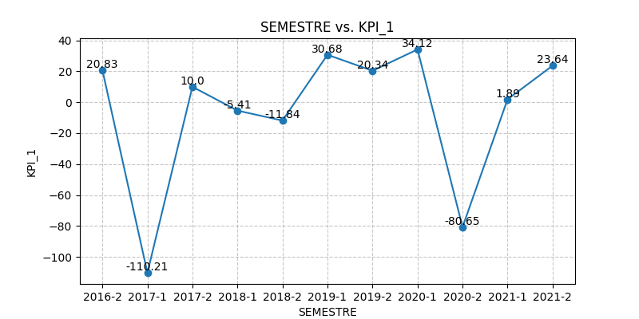
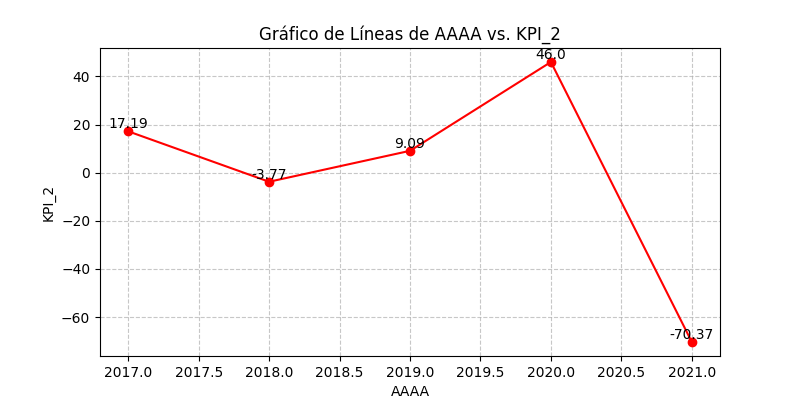
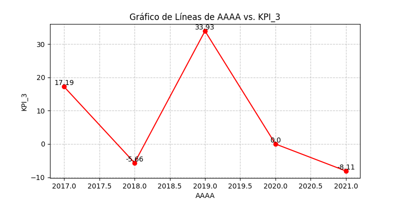

# Análisis de datos- Siniestros Viales
### Objetivos:
El objetivo de este proyecto de analisis de datos con el fin de generar información que le permita a las autoridades locales tomar medidas para disminuir la cantidad de víctimas fatales de los siniestros viales. Para eso se evaluan 3 KPIs diferentes entre los años 2016-2021 y luego se elabora un Dashboard para la presentación de los datos.

### Introducción:
En Argentina, cada año mueren cerca de 4.000 personas en siniestros viales. Aunque muchas jurisdicciones han logrado disminuir la cantidad de accidentes de tránsito, esta sigue siendo la principal causa de muertes violentas en el país.Solo en 2022, se contabilizaron 3.828 muertes fatales en este tipo de hechos. Los expertos en la materia indican que en Argentina es dos o tres veces más alta la probabilidad de que una persona muera en un siniestro vial que en un hecho de inseguridad delictiva.
En el contexto de una ciudad como Buenos Aires, los siniestros viales pueden ser una preocupación importante debido al alto volumen de tráfico y la densidad poblacional. Estos incidentes pueden tener un impacto significativo en la seguridad de los residentes y visitantes de la ciudad, así como en la infraestructura vial y los servicios de emergencia.
Las tasas de mortalidad relacionadas con siniestros viales suelen ser un indicador crítico de la seguridad vial en una región. Estas tasas se calculan, generalmente, como el número de muertes por cada cierto número de habitantes o por cada cierta cantidad de vehículos registrados. Reducir estas tasas es un objetivo clave para mejorar la seguridad vial y proteger la vida de las personas en la ciudad. Para poder evaluar las tasas, existen 3 KPIs a evaluar.

`KPI 1` Reducir en un 10% la tasa de homicidios en siniestros viales de los últimos seis meses, en CABA, en comparación con la tasa de homicidios en siniestros viales del semestre anterior.
Definimos a la **tasa de homicidios en siniestros viales** como el número de víctimas fatales en accidentes de tránsito por cada 100,000 habitantes en un área geográfica durante un período de tiempo específico.
    Su fórmula es: (Número de homicidios en siniestros viales / Población total) * 100,000

 `KPI 2` Reducir en un 7% la cantidad de accidentes mortales de motociclistas en el último año, en CABA, respecto al año anterior.
Definimos a la **cantidad de accidentes mortales de motociclistas en siniestros viales** como el número absoluto de accidentes fatales en los que estuvieron involucradas víctimas que viajaban en moto en un determinado periodo temporal.
    Su fórmula es: (Número de accidentes mortales con víctimas en moto en el año anterior - Número de accidentes mortales con víctimas en moto en el año actual) / (Número de accidentes mortales con víctimas en moto en el año anterior) * 100
    
`KPI 3` Reducir en un 5% la cantidad de accidentes mortales en el horario nocturno en el último año, en CAB, respecto al año anteriror.
Definimos a la **cantidad de accidentes mortales nocturnos** como el número absoluto de accidentes fatales entre las 22 PM y las 7 AM, en un determinado periodo temporal.
    Su fórmula es: (Número de accidentes mortales nocturnos en el año anterior - Número de accidentes mortales nocturnos en el año actual) / (Número de accidentes mortales nocturnos en el año anterior) * 100

### Estructura del proyecto:
- [Data/](https://github.com/nahirmaraz/Analisis_SiniestrosViales/tree/main/DATA): Carpeta en la que se encuentran los datasets utilizados en el desarrollo del proyecto.
    - [/Iniciales](https://github.com/nahirmaraz/Analisis_SiniestrosViales/tree/main/DATA/Iniciales): Carpeta en la que se encuentran los datasets iniciales en formato xlsx, tanto de homicidios cono de población.
    - [/Limpios](https://github.com/nahirmaraz/Analisis_SiniestrosViales/tree/main/DATA/Limpios): Carpeta donde se encuentran los datasets de hechos, vicitmas y poblacion, en formato CSV, luego de haber pasado por el proceso de ETL y EDA.
    - [/KPIs](https://github.com/nahirmaraz/Analisis_SiniestrosViales/tree/main/DATA/KPIs): Carpeta donde se encuentras los DataFrames construidos por cada KPI, en formato CSV.
- [Imágenes/](https://github.com/nahirmaraz/Analisis_SiniestrosViales/tree/main/Im%C3%A1genes): Carpeta donde se encuentran las imágenes a utilizar en el README.
- [EDA_hechos.ipynb](https://github.com/nahirmaraz/Analisis_SiniestrosViales/blob/main/EDA_hechos.ipynb): Notebook en el cual se realizó el proceso de ETL y EDA para los datos de la tabla hechos.
- [EDA_victimas.ipynb](https://github.com/nahirmaraz/Analisis_SiniestrosViales/blob/main/EDA_victimas.ipynb): Notebook en el cual se realizó el proceso de ETL y EDA para los datos de la tabla victimas.
- [ETL_Poblacion.ipynb](https://github.com/nahirmaraz/Analisis_SiniestrosViales/blob/main/ETL_Poblacion.ipynb): Notebook en donde se realizó el ETL correspondiente para el dataset buscado se poblacion.
- [KPI_1.ipynb](https://github.com/nahirmaraz/Analisis_SiniestrosViales/blob/main/KPI_1.ipynb): Notebook en el que se realizó el DataFrame específico para el KPI 1.
- [KPI_2.ipynb](https://github.com/nahirmaraz/Analisis_SiniestrosViales/blob/main/KPI_2.ipynb): Notebook en el que se realizó el DataFrame específico para el KPI 2.
- [KPI_3.ipynb](https://github.com/nahirmaraz/Analisis_SiniestrosViales/blob/main/KPI_3.ipynb): Notebook en el que se realizó el DataFrame específico para el KPI 3.
- [SiniestrosViales.pbix](https://github.com/nahirmaraz/Analisis_SiniestrosViales/blob/main/SiniestrosViales.pbix): Link con el que se puede descargar el Dasboard hecho en PowerBI.

### Desarrollo:
Se realizó una ETL sobre los tres datasets a utilizar, el de victimas y homicidios (dados) y el de población (buscado). Luego de tener los datos limpios, se realizó un EDA para cada uno en donde se abordaron los temas de  búsqueda de valores faltantes, valores atípicos/extremos u outliers y registros duplicados. También se realizaron gráficos coherentes según la tipología de variable que corresponda resulta esencial y segun el análisis univariado o multivariado.
Luego, al ya tener solo las columnas que necesito para mis KPIs y de haber entendido el comportamiento de mis datos con el EDA, se procede a hacer un DataFrame para cada KPI, asi luego se puede llevar a Power BI de la manera mas limpia y facil de trabajar.
Una vez hechos las tablas para cada KPI, se las exportó a CSV y se trabajó con PowerBI para el armado de la visualización. Para eso se tuvo especial cuidado en las relaciones entre tablas, asi funcionaban bien los filtros.

### Resultados:

Como se puede observar un número de KPI 1 positivo, representa una baja en la tasa de homicidios semestral. Por lo tanto, un KPI 1 negativo significa que la tasa aumentó. En ambos casos, cuanto mayor sea el módulo, mas abrupto es el cambio.
En el gráfico, vemos que una pendiente negativa es igual a un aumento de la Tasa de homicidios. Por lo contario, una pendiente positiva, es una disminución en la Tasa de homicidios semestral. En el primer semestre del 2017 y el segundo semstre del 2020 hubo un aumento muy abrupto y considerable de la Tasa de homicidios a pesar de que en los semestres anteriores se venia viendo, a grandes rasgos, una mejora.
En general podemos decir que la Tasa de Homicidios semestral fue mejorando, ya que 7 puntos de 11 son positivos y 4 puntos de 11 son negativos.

Un KPI positivo significa la reduccion de accidentes de motociclistas anual. Por el contrario un KPI negativo significa el aumento de accidentes motobilisticos anual. Cuanto mas grande el módulo, mas grande la variación entre un año y el otro.
El gráfico muestras pendientes negativas cuando se aumenta la cantidad de acidentes de motociclistas anuales. Las pendientes positivas indican una reduccion de la cantidad de accidentes anuales. La caída mas abrupta se ve en el 2021 que aumentó considerablemnte la cantidad de accidentes.

Un KPI 3 positivo significa que  la cantidad deaccidentes nocturnos disminuyó de un año a otro. Caso contrraio es cuando el KPI 3 es negativo. A mayor módulo, más abrupto el cambio.
Analizando el gráfico, vemos que los cambios son mus pronunciados. Una pendiente negativa significa que la cantidad de accidentes nocturnos aumentó. Una pendiente porsitiva, significa que la cantidad de accidentes nocturnos disminuyó. Exceptto en el 2020 que quedó igual respecto del año anteriror, eso significa el valo 0.

### Conclusiones:
Podemos concluir que los siniestros viales en CABA no están muy controlados, ya que los mayores KPI los encontramos en el segundo semestre del 2019 y primero del 2020, cuando estabamos confinados por la pandemia.No es que hubo menos homicidios por una regulación de estos, se demuestra en la baja de los KPIs del semestre siguiente. También, luego de la exploración de los datos en el EDA podemos ver a que grupo habría que hacer hincapié en la educación vial, a los hombres entre 20 y 40 años, mas que nada en la Comuna 1,4 y 9.
### Bibliografía:
- [Fuente de datos](https://data.buenosaires.gob.ar/dataset/victimas-siniestros-viales): Link en donde se obtuvieron los datasets iniciales-crudos, asi también como los diccionarios de datos de cada dataset.
- [Consignas](https://github.com/nahirmaraz/PI_DA/tree/Full_Time):Link al repositorio de GitHub con las consignas del proyecto.
- [Población 2016-2021 CABA](): Link de donde se sacó el dataset faltante de población.
- [Comunas](https://buenosaires.gob.ar/jefaturadegabinete/atencion-ciudadana-y-gestion-comunal/gestion-comunal/comunas): Link de donde se obtiene la información de la conformación de las Comunas.
- [Paleta de colores](https://buenosaires.gob.ar/manual-de-marca): Link en donde se obtuvo el manual de marca de la Ciudad de Buenos Aires para utilizar la paleta de colores que corresponde.